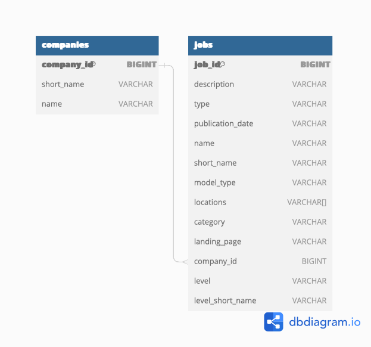

# The Muse Jobs API Scraper

## Requirements 
- Script was developed using Python 3.8.9

## Installation
- Create virtual environment and install dependencies from `requirements.txt`: 
    ```python
    python3 -m venv
    source venv/bin/activate
    pip install -r requirements.txt
    ```
- If using an API Key, it must be set as an environment variable 
    - Edit `venv/bin/active` script 
    - Add line `export MUSE_API_KEY="{MUSE_API_KEY_HERE}"`
    - Restart venv: `source venv/bin/activate`

### Important Packages
- Pandas: Used to store and format data between extraction and loading in a destination database
- [DuckDB](https://duckdb.org): Used as a local SQL database to store API results for later querying 
## Running The Script
```python
python load_data.py
```
### Optional Arguments
```
-p --pages The number of pages to query from the API. If omitted, the script will continue to query until all available pages are exhausted. Note, the script will always start with page 0.
``````

## Querying Output
- The script saves a copy of the resulting database to `muse_jobs.duckdb`. 
- I used [DBeaver](https://dbeaver.io) to connect to the database and write queries against it 

### Database Schema
- Two tables are defined
    - `jobs`: Has a single record for each job that was loaded from the API
    - `companies`: Has a single record for each company that was extracted from the jobs API response
- Other tables I'd like to create in the future, but did not because of lack of a primary key to use
    - Locations: The job API responded with a list of dictionary objects each with only one key, `name`. Given this format, I chose to extract the names and store them in an array within the main jobs table, but I could imagine a future state where the city and state/country information (along with additional fields) are parsed and stored in their own table if there was a primary key to join back to the jobs table 
    - Levels: I could imagine a similar setup for the `levels` information. In this case, the `short_name` actually could likely be used as a primary key for the additional table, but with only one other column of data, it seemed like overkill in this situation
- 

### New York City Metro Area Query
#### Output 

| nycma_jobs  | nycma_remote_jobs | tristate_remote_jobs |
|-------------|-------------------|----------------------|
| 0           | 1                 | 3                    |

#### Notes 
- Based on the data that I was able to acquire from the API, there are 0 jobs that meet the given criteria. Based on exploration on the API website, it does seem like this is the expected answer as "New York City Metro Area" doesn't appear to be a valid location option, but for fun, I tried two expanded versions of the query: 
    1. Including all remote eligible jobs as well as these could theoretically be done from the NYC Metro Area as well
    2. Including all remote eligible jobs as well as any appearing to be in the tristate area (NY, NJ, or CT)
